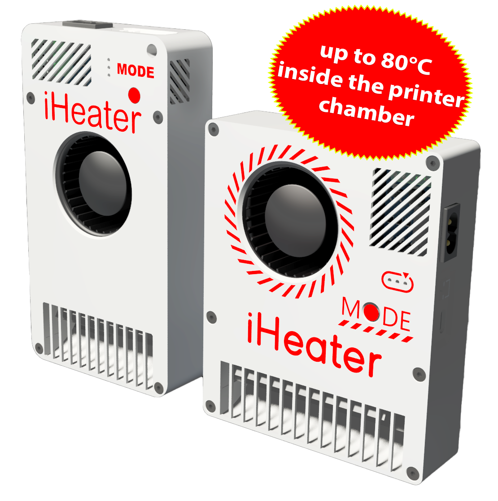
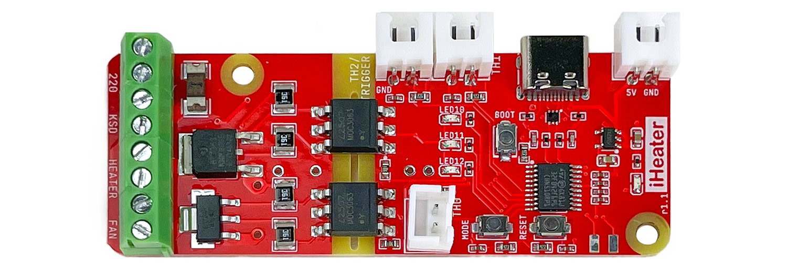

# iHeater プロジェクトについて

iHeater は、3D プリンター内にアクティブな恒温チャンバーを構築するためのコンパクトなヒーターです。特に Creality、Bambu Lab、FlashForge など、クローズドまたは独自仕様の電子基板を搭載し、ヒーター、ファン、サーミスターを接続するための空きコネクターがないモデルで有用です。

USB で接続し、メインボードの制約を受けずに動作します。ファームウェアに応じて、Klipper と完全に統合して使用することも、スタンドアロンで使用することもできます。

iHeater はベッド加熱と組み合わせることで、チャンバー全体を均一に加熱します。これは ABS、PA、PC などのエンジニアリングプラスチックを印刷する際の重要な要素です。空気温度に応じて加熱を動的に制御し、過熱や温度変動を抑えながら、チャンバー内に安定した環境を作ります。

2 つのバージョンがあります。

- 100 W - 小型プリンター向け（アーカイブ版）
- 200 W - より大型のプリンター向け

[このカリキュレーターで事前試算を行えます](https://docs.google.com/spreadsheets/d/1u6XrWLFZGOUnRlFPjjGsJB_GLuFFIs3fFWLCp2-K8gc/edit?usp=sharing)

## 使用方法

### Klipper 制御下で使用

基板は Klipper の独立した MCU として動作し、チャンバー加熱とファンを完全に自律制御します。220 V から給電するため、プリンターの電源ユニットに負荷をかけません。標準の電源ユニットは余裕が少ないことがよくあります。

基板のコストは、マイクロコントローラー、SSR、必要な部品を使って同等の構成を自作する場合と同程度か、それ以下です。必要であれば、愛好家が同等の構成を自作することもできます。

### iHeater ファームウェアで使用

iHeater 基板は自己完結型で、スタンドアロン機器として使用するために必要な周辺回路をすべて備えています。目標温度は MODE ボタンを順に押して設定し、3 つの LED に表示されます。

## ライセンス

このプロジェクトは MIT ライセンスの下で配布されています。詳細は [LICENSE](license.md) ファイルを参照してください。

!!! danger "加熱要素の取り扱い"
    加熱要素の使用および温度制御には、火災や機器損傷のリスクがあります。安全上の注意を守ってください。詳細は [安全性](safety.md) セクションを参照してください。
