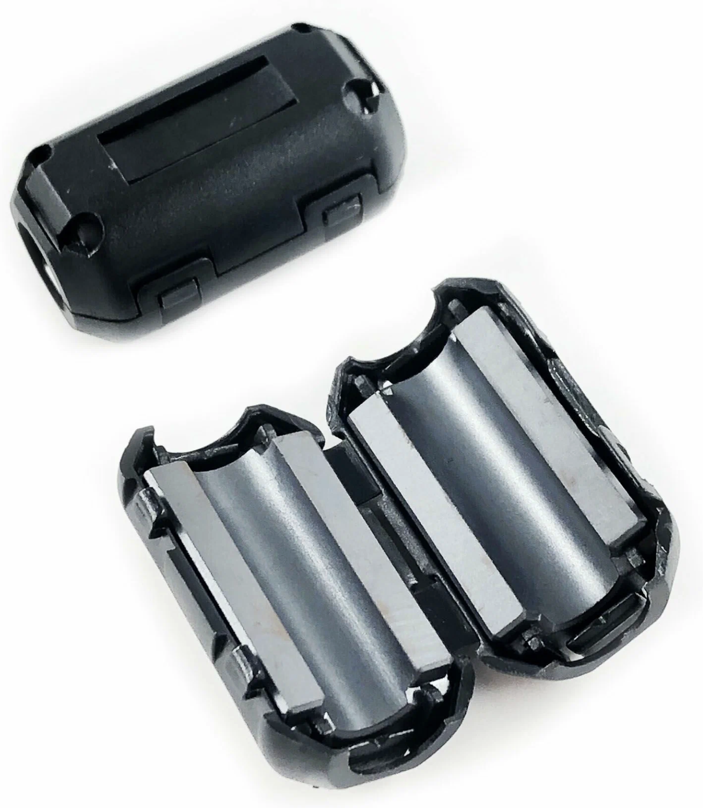
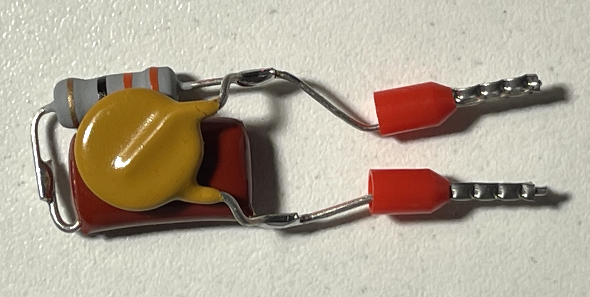
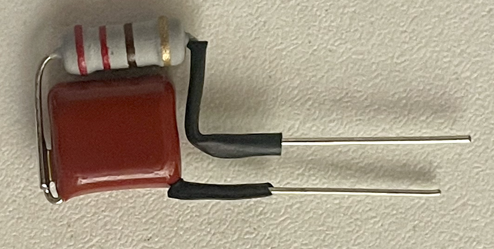

# iHeater の通信問題と対処方法

**iHeater** を使用していると、接続の安定性に問題が発生する場合があります（切断、MCU の「消失」、動作の不安定化など）。  
多くの場合、原因はデバイス本体ではなく、振動、電磁ノイズ、負荷特性などの外部要因です。

以下に、主な原因と対処方法を示します。

---

## 1. USB ケーブルの振動

!!! warning "症状"
    - 接続が周期的に切断される  
    - デバイスがシステムから「消える」  
    - ケーブルに触れると接続が復旧する  

!!! info "原因"
    プリンターの振動により USB コネクタが微小に動き、短時間の接触不良が発生することがあります。

!!! success "対処方法"
    - USB ケーブルをコネクタにしっかり固定する  
    - ケーブルに張力がかからないようにする  
    - 必要に応じて:
        - より差し込みが固いケーブルを使用する  
        - ホットボンド / 結束バンド / ホルダーでケーブルを固定する  

---

## 2. 電源線からの誘導ノイズ

!!! warning "症状"
    - ヒーターまたはファンの起動時に通信が途切れる  
    - デバイスがランダムに再起動する  
    - 明確な原因なしに動作が不安定になる  

!!! info "原因"
    AC 電源線は電磁ノイズを発生させ、そのノイズが USB ケーブルに誘導されることがあります。

 

!!! success "対処方法"
    - USB ケーブルと電源線をできるだけ離して配線する  
    - 同じケーブルダクト内に通さない  
    - 長い区間で並行配線しない  
    - USB ケーブルにフェライトフィルター（フェライトコア）を取り付ける。取り付け位置はコントローラーおよび(または)プリンター基板に近い側にする

---

## 3. ファンからのノイズ

!!! warning "症状"
    - ファンのオン/オフ時に通信が途切れる  
    - ファン動作と同時に不具合が発生する  
    - PWM 制御時に不安定になる  

!!! info "原因"
    110-220V のファンにはスイッチング電源が搭載されており、他のスイッチング電源と同様のノイズを発生させることがあります。
    このノイズが信号線に影響する場合があります。

!!! success "対処方法"
    **RC スナバ (snubber)** をファンと並列に取り付けることを推奨します。またはフェライトフィルターを使用してください

---

## 4. USB 3.0 ポート - 運用時の問題

!!! warning "症状"
    - 動作中に接続が周期的に切断される  
    - 明確な原因なしにデバイスがシステムから「消える」  
    - 別のポートへ差し替えると問題が解消する  

!!! info "原因"
    これは Full Speed (USB 2.0) モードで動作する USB デバイスを USB 3.0 ポートへ接続した場合に発生する、一般的な問題です。最近のコンピューターでは USB 3.0 ポートに eUSB2 リピーターが使われており、USB 2.0 仕様と完全には互換性がありません。その結果、同期不良やデバイス列挙エラーが発生します。この問題は STMicroelectronics によって公式に確認されています: [ST サイトの FAQ](https://community.st.com/t5/stm32-mcus/faq-possible-communication-failure-between-stlink-v3-and-some/ta-p/736578)。

!!! success "対処方法"
    - iHeater は **USB 2.0 ポート**（通常は黒いコネクタ）にのみ接続する  
    - すべてのポートが USB 3.0 の場合は、**USB 2.0 ポート付きのアクティブ USB ハブ**を使用する

---

## 5. USB 3.0 ポート - ファームウェア書き込み時の問題

!!! warning "症状"
    - コントローラーが DFU モードで認識されない  
    - ファームウェア書き込みがエラーで終了する、または停止する  
    - `dfu-util` がデバイスを認識しない、または書き込みを中断する  

!!! info "原因"
    同じ USB 3.0 / xHCI 互換性の問題です。特に最近のノート PC で USB Type-C ポート経由で書き込む場合に発生しやすく、問題のある eUSB2 リピーターが使われていることが多いためです。

!!! success "対処方法"
    - ファームウェア書き込み時は、コントローラーを **USB 2.0 ポート**にのみ接続する  
    - PC 背面の USB Type-A ポートを優先して使用する  
    - 問題が続く場合は、**USB 2.0 ポート付きのアクティブ USB ハブ**を使用する

    
