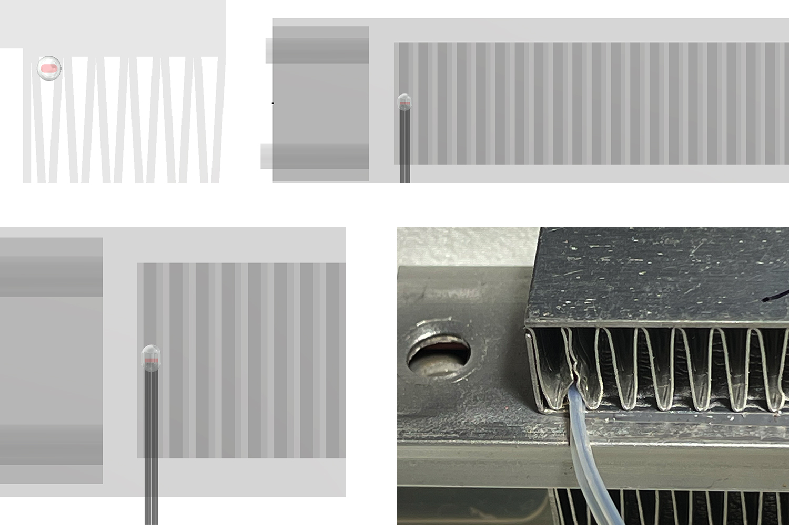
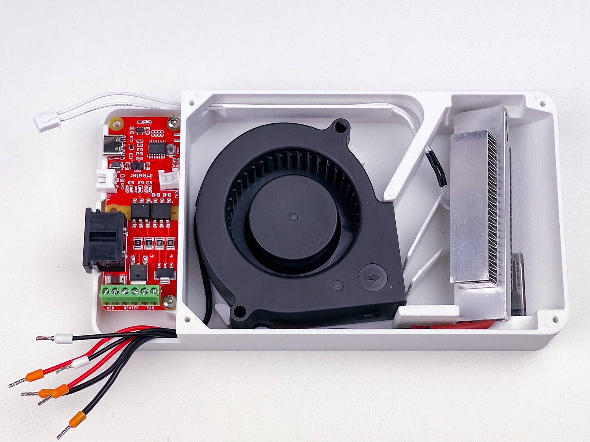
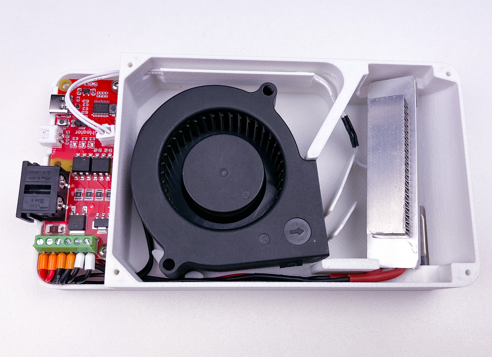
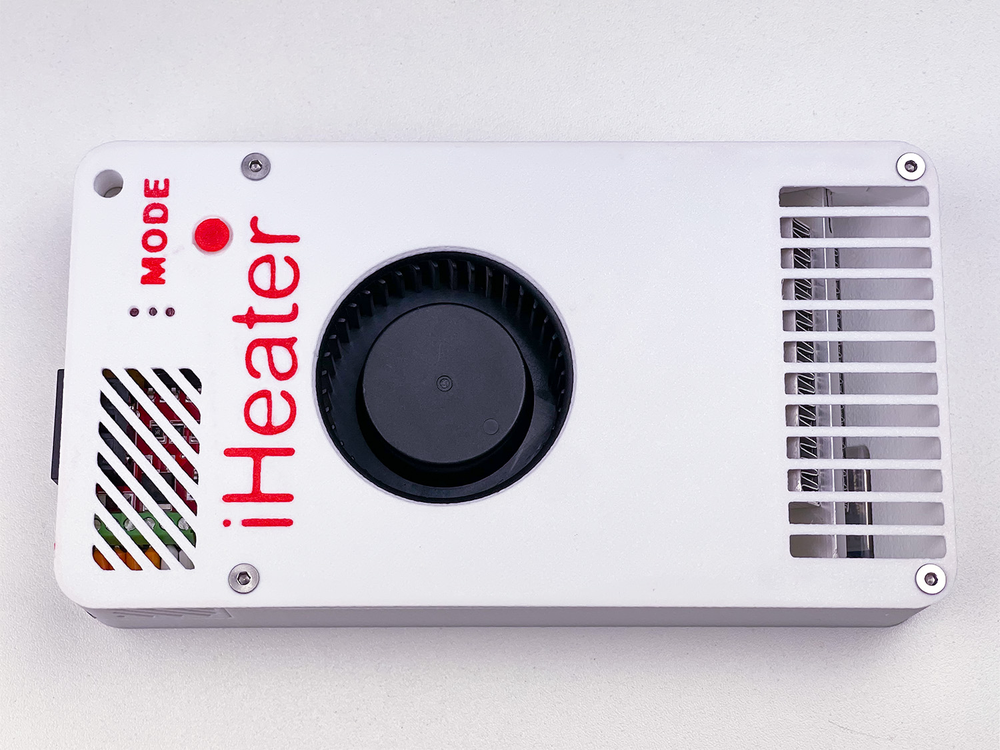

# Montagem

Leia a documentação, baixe e imprima as peças necessárias. Certifique-se de ter todos os componentes e ferramentas antes de iniciar a montagem.

!!! danger "Trabalho com tensão da rede elétrica"
    Todos os trabalhos de ligação à rede de 110–230 V devem ser realizados com o dispositivo desenergizado. Mais detalhes na seção [Segurança](safety.md).

## Antes da montagem

Recomenda-se primeiro montar todo o sistema **sobre a bancada**, sem instalá-lo na caixa, e realizar os testes:

- Conectar **todos** os componentes.
- Verificar o funcionamento do aquecedor, ventilador e sensores de temperatura.
- Conectar o sistema ao **Klipper** ou gravar o firmware Standalone e garantir que tudo funcione corretamente.

Video guide: [YouTube](https://youtu.be/1QMtVY0Vx-8?si=Ol1u4Ux9wALDcfe2)

## Montagem passo a passo

### Instalação da placa

### Instalação do termistor e do Thermal Protector

!!! warning "Instalação do termistor"
    Certifique-se de que as partes expostas dos fios na base do termistor não entrem em contato com o corpo metálico do aquecedor. Se necessário, isole essas partes com fita Kapton ou coloque-as em um tubo de teflon / tubo termo-retrátil.

    A temperatura do aquecedor pode chegar a 140 °C.

!!! warning "Instalação do Thermal Protector"
    É possível instalar um KSD9700 (Thermal Protector, auto-resetável) ou um Thermal Fuse descartável.

    O KSD9700 abre o circuito em caso de superaquecimento e o fecha automaticamente quando esfria. O Thermal Fuse (por exemplo, **RH130**) interrompe o circuito permanentemente quando acionado — uma proteção mais confiável em caso de falha.

    Use o KSD9700 na etapa de depuração e depois substitua-o por um Thermal Fuse para operação permanente.

### Instalação do aquecedor

!!! warning "Instalação do termistor"
    Instale o termistor na borda do aquecedor, aproximadamente no meio da altura das aletas do dissipador.

    As partes expostas dos fios na base do termistor não devem tocar o corpo metálico do aquecedor. Se necessário, isole essas partes com fita Kapton ou coloque-as em um tubo de teflon / tubo termo-retrátil.

    A temperatura do aquecedor pode chegar a 140 °C.

### Fiação

### Instalação de terminais NShVI

### Conexões

### Montagem final

### Produto finalizado

