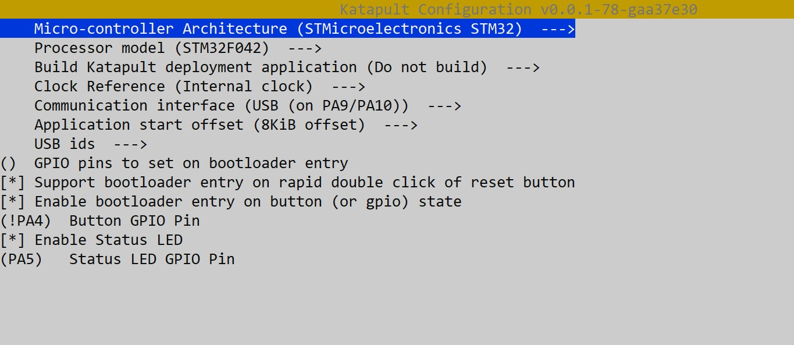

#  固件刷写

本文档包含为 **iHeater** 微控制器构建和刷写 **Katapult** bootloader 的说明。Katapult bootloader 允许通过 USB 刷写 Klipper 固件，并且包含在 **iHeater** 控制器上安装 **Klipper** 固件的文档。

---

## 需要准备

- STM32F042F6P6
- iHeater 主板
- USB 线缆
- Linux 系统（例如 Raspberry Pi 或打印机）

!!! warning "如果无法在打印机上构建和刷写固件"
    [请参阅 WSL 章节](../user-mods/software/wsl2-ubuntu-ff/)

---

## 构建 Katapult

1. 克隆 Katapult 仓库：

```bash
git clone https://github.com/Arksine/katapult.git
```
```
cd katapult
```
```
make menuconfig
```

2. 在 `menuconfig` 中选择：



3. 构建：

```bash
make
```

固件将生成在 `out/katapult.bin`。


---

## 通过 DFU 刷写 Katapult

> 此步骤只需执行一次，用于刷写 Katapult 本身。

### 准备：
如果尚未安装 dfu-util，请安装该工具：
    
    sudo apt install dfu-util

根据主板版本：

=== "r1"

    将跳线帽安装到 BOOT0，然后重新给主板上电（或按 RESET 按钮）。
    微控制器将进入 DFU 模式。

=== "r1.1"

    按住 BOOT 按钮并重新给主板上电（或按 RESET 按钮），然后松开 BOOT。
    微控制器将进入 DFU 模式。

检查连接：

    lsusb

结果：

    ID 0483:df11 STMicroelectronics STM Device in DFU Mode

### 刷写 Katapult：
切换到 DFU 模式。

执行命令：

```
dfu-util -a 0 -D out/katapult.bin -s 0x08000000:leave
```

成功刷写示例：

```
Downloading to address = 0x08000000, size = 4968
Download        [=========================] 100%         4968 bytes
Download done.
File downloaded successfully
Transitioning to dfuMANIFEST state
```

退出 DFU 模式。

重启后
```
ls /dev/serial/by-id/*
```
结果：
```
/dev/serial/by-id/usb-katapult_stm32f042x6_XXXXXXXXXXXXXX-if00
```

如果没有权限，刷写时可能会出现错误。要获取访问权限，请执行命令：
```
sudo chmod 777 /dev/serial/by-id/usb-katapult_stm32f042x6_XXXXXXXXXXXXXX-if00
``` 

!!! warning "如果出现问题"
    擦除 MCU 内存并重复前面的步骤
    ```
    touch /tmp/empty.bin
    ```
    ```
    dfu-util -a 0 -d 0483:df11 -s :mass-erase:force -D /tmp/empty.bin
    ```

### 备注

- Katapult 占用 Flash 的前 8 KB，因此**在 Klipper 中必须指定 8 KiB offset**。
- 可以使用双击 Reset，或使用 GPIO (PA4) 上的按钮进入 DFU。
- 如果 PA13/PA14 用于 SWD
- 刷写 Katapult 后，可以不再使用 ST-Link，后续所有操作都通过 USB 完成。

## 在 iHeater 上安装固件

### 编译固件
```
cd ~/klipper
```
```
make menuconfig
```

#### 在配置菜单中选择
```
Enable extra low-level configuration options

Micro-controller Architecture (STMicroelectronics STM32)

Processor model (STM32F042)

Bootloader offset (8KiB bootloader)

Clock Reference (Internal clock)

Communication interface (USB (on PA9/PA10))
```
#### 关闭所有不需要的选项
```
[*] Support micro-controller based ADC (analog to digital)
[ ] Support communicating with external chips via SPI bus
[ ] Support communicating with external chips via I2C bus
[*] Support GPIO based button reading
[ ] Support Trinamic stepper motor driver UART communication
[ ] Support 'neopixel' type LED control
[ ] Support measuring fan tachometer GPIO pins
    *** LCD chips ***
[ ] Support ST7920 LCD display
[ ] Support HD44780 LCD display
    *** External ADC type chips ***
[ ] Support HX711 and HX717 ADC chips
```

#### 保存并退出菜单。

#### 编译固件
```
make clean
```
```
make
```

结果：

    Creating hex file out/klipper.bin

### 将固件安装到 iHeater 主板

!!! note "可能需要安装 python3-serial"
    
    sudo apt install python3-serial

**下面介绍的是已安装 Katapult bootloader 的安装方式**

- 将 iHeater 以编程模式连接到主机（连接时按住 Mode 按钮，或双击 RESET）。

- 执行搜索
    ```
    ls /dev/serial/by-id/
    ```
    结果应类似如下：

    ```
    usb-katapult_stm32f042x6_XXXXXXXXXXXXXXXXXXXXXXXX-XXXX
    ```

    - 如有需要，安装 flashtool

    ```
    pip install flashtool
    ```

- 替换为自己的 ID 并输入：
    
        python3 ~/katapult/scripts/flashtool.py -d /dev/serial/by-id/usb-katapult_stm32f042x6_XXXXXXXXXXXXXXXXXXXXXXXX-XXXX -f ~/klipper/out/klipper.bin

    结果：

        Flashing '/home/pi/klipper/out/klipper.bin'...

        [##################################################]
        
        Write complete: 20 pages
        
        Verifying (block count = 319)...
        
        [##################################################]
        
        Verification Complete: SHA = 8A3DDF39A0E70B684DC6BAF74EF8F089EBDD6C18
        
        Flash Success

- 检查：
    ```        
    ls /dev/serial/by-id/
    ```
    结果：

        usb-Klipper_stm32f042x6_0C0018000D53304347373020-if00

    ```iHeater 已准备好与 Klipper 一起使用```
